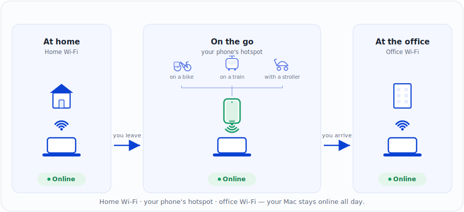

<p align="center">
  
</p>

<h1 align="center">Limpet</h1>

<p align="center">
  <b>Keep your Mac online when it leaves Wi-Fi — by failing over to your phone's hotspot, automatically.</b>
</p>

<p align="center">
  
  
  
  
  
</p>

<p align="center">
  
</p>

A small, robust macOS tool that keeps a MacBook on the internet while it's open and awake
in your bag — with Amphetamine or `caffeinate` keeping it from sleeping. When it loses
connectivity, it reconnects to your saved networks and, as a last resort, joins your
**phone's hotspot** — on its own, with no clicking in the Wi-Fi menu. Any phone that can
share a hotspot works (iPhone, Android, anything); a hotspot is just another saved Wi-Fi
network as far as Limpet is concerned.

It's a single shell script that runs as a per-user background agent, plus an optional native
menu-bar companion. No login, no account, no daemon talking to the cloud. The hotspot
password lives in your Keychain, not in a file.

---

## Is this for you?

**Limpet is for you if…**

- you keep a Mac open and working while it's in a backpack, a drawer, or moving between rooms and buildings;
- you run things that must *not* drop offline: AI coding agents, SSH sessions, long builds, syncs, remote access;
- you'd rather it silently fall back to your phone's hotspot than babysit the Wi-Fi menu.

**It's probably overkill if…**

- your Mac sits on one desk, on one Wi-Fi, all day — macOS already handles that fine.

That's the whole pitch. If the first list sounds like you, the rest of this README is the manual.

---

## How it works

Limpet runs as a background agent (started by a LaunchAgent at login) and loops:

1. **Checks for *real* internet** — it isn't satisfied with "I have an IP / a gateway." It uses
   more than one method:
   - a direct `ping` to `1.1.1.1` / `8.8.8.8` (L3 reachability, no DNS);
   - an HTTP request to `captive.apple.com` (checks DNS + HTTP + detects captive portals);
   - an HTTPS fallback straight to `https://1.1.1.1` (checks TLS without DNS).
2. **If it works → it does nothing.** It never changes a working network.
3. **If it doesn't → it remediates**, in order:
   - **A.** let macOS reconnect to a saved network on its own, then re-check;
   - **B.** cycle **Wi-Fi off/on** (fixes many "connected but dead" cases);
   - **C.** try the preferred networks from your config (home, office), in order;
   - **D.** join your **phone's hotspot** (password read from the Keychain).
4. After each attempt it **re-checks** real internet.
5. If nothing works → **exponential backoff** (45s → 90 → 180 → … → max 300s), so it never
   spins in a tight loop burning CPU or battery.
6. **Clear logs** about what it tried and what it got.

States it handles separately: Wi-Fi connected but no internet · Wi-Fi disconnected ·
hotspot unavailable · hotspot present but no internet · captive portal.

### Built for modern macOS (tested on macOS 26 / Tahoe)

- **Doesn't rely on reading the SSID.** On recent macOS, `networksetup -getairportnetwork` is
  unreliable (it returns "not associated" or `<redacted>` even when you're connected). Limpet
  confirms connectivity via **active link + IP + a real internet test**, not by name.
- **Doesn't use the `airport` binary** (removed in macOS 14.4+). Scanning is best-effort
  (`system_profiler`); if names are hidden, it tries known networks "blind."
- **Auto-detects the Wi-Fi interface** (doesn't assume `en0`).
- **Native commands only:** `networksetup`, `ifconfig`, `ipconfig`, `route`, `ping`, `curl`,
  `security`, `system_profiler`. No external dependencies. Runs on the `bash 3.2` that ships
  with macOS.

---

## Install

### Homebrew (recommended)

```bash
brew install --cask georgeolaru/tap/limpet   # notarized menu-bar app + the limpet CLI/daemon
brew services start limpet                    # start the background agent (per-user, no sudo)
```

`brew install --cask` installs the signed, **Apple-notarized** Limpet.app and pulls in the
`limpet` formula (the daemon + `limpet` command). `brew services start limpet` runs the agent
in your login session — the same per-user LaunchAgent the script uses, no `sudo`. Later:
`brew upgrade` to update, `brew services stop|restart limpet` to control the agent.

> **CLI / headless only?** Skip the app — `brew install georgeolaru/tap/limpet` installs just
> the daemon and the `limpet` command, then `brew services start limpet`.
>
> Wherever this README shows `~/.local/bin/limpet.sh`, a Homebrew install puts the same command
> on your `PATH` simply as `limpet`.

### From source (`install.sh`)

No Homebrew needed — this compiles the menu-bar app locally with `swiftc`:

```bash
cd limpet
bash install.sh
```

The installer:

- copies the script to `~/.local/bin/limpet.sh` (executable);
- compiles the menu-bar app to `~/Applications/Limpet.app` if `swiftc` is available;
- installs the app icon into the menu-bar app bundle;
- creates `~/.config/limpet/config.sh` from the example (if it doesn't already exist);
- generates the LaunchAgents with real paths in `~/Library/LaunchAgents/`;
- loads them into `launchd` (the agent + menu bar start immediately, and at every login).

> **Pick one path.** Don't run the Homebrew install *and* `install.sh` — each starts its own
> background agent and menu-bar app, and two agents will fight over Wi-Fi. To switch, uninstall
> the other first.

**Then, one-time setup** — see [Set up your phone's hotspot](#set-up-your-phones-hotspot):

1. Make the hotspot reliable (a couple of iOS/Android settings).
2. Connect your Mac to it once, so macOS saves the network + password.
3. Point Limpet at it — `HOTSPOT_SSID`, the Keychain password, and the gateway range (see [Configuration](#configuration)).

<details>
<summary><b>Manual install</b> (if you prefer step by step)</summary>

```bash
# 1. Copy the script and make it executable
mkdir -p ~/.local/bin
cp limpet.sh ~/.local/bin/limpet.sh
chmod +x ~/.local/bin/limpet.sh

# 2. The config
mkdir -p ~/.config/limpet
cp config.example.sh ~/.config/limpet/config.sh
# edit ~/.config/limpet/config.sh

# 3. The plist in LaunchAgents (edit the paths if your user isn't 'georgeolaru')
cp com.georgeolaru.limpet.plist ~/Library/LaunchAgents/

# 4. Load it
launchctl bootstrap gui/$(id -u) ~/Library/LaunchAgents/com.georgeolaru.limpet.plist
# (on older macOS: launchctl load -w ~/Library/LaunchAgents/com.georgeolaru.limpet.plist)
```

</details>

---

## Set up your phone's hotspot

Limpet treats your phone's hotspot as just another saved Wi-Fi network, so setup is three
things, once:

1. **Make the hotspot reliable** — the per-platform settings below.
2. **Connect your Mac to it once** (Wi-Fi menu → the hotspot → enter the password → tick
   "Remember this network"), so macOS saves the network and its password.
3. **Point Limpet at it** — set `HOTSPOT_SSID` to the hotspot's exact name, store the password
   in the Keychain (below), and set the gateway range in `HOTSPOT_GATEWAY_PREFIXES` (see
   [Configuration](#configuration)).

> **⚠️ The setting that matters most:** both iOS and Android **turn the hotspot off when no
> device is connected**, to save battery. For an unattended failover tool that's the usual
> reason a reconnect fails — the phone has stopped broadcasting by the time the Mac comes
> looking. Limpet joins the hotspot like a normal saved network (it can't *wake* a sleeping
> iPhone hotspot the way Continuity does), so the steps below disable that timeout or work
> around it. Get this right and the rest rarely matters.
>
> **Same-Apple-ID iPhone on macOS 26+? You can skip these workarounds** — macOS's Auto-Join
> *can* wake a slept hotspot over Bluetooth, and Limpet yields to it (see the iPhone section
> below). The timeout workarounds matter for **Android or a different Apple ID**.

<details>
<summary><b>iPhone / iOS</b></summary>

In **Settings → Personal Hotspot**:

- **Allow Others to Join: ON.**
- **Maximize Compatibility: ON** (iPhone 12 and later). This drops the hotspot to **2.4 GHz**
  and forces **WPA2** — slower, but the most reliable band for a Mac across a room or in a
  bag, and WPA2 is the safest for a scripted join. (The default is 5 GHz.)
- Note the **password** shown here, and the hotspot **name** = your iPhone's name
  (**Settings → General → About → Name**). Renaming the iPhone, or changing the password,
  breaks the saved network.
- **Keep it from sleeping** while you rely on it: avoid **Low Power Mode** and **Low Data
  Mode**, and either keep the Personal Hotspot screen open or set **Auto-Lock** longer
  (Settings → Display & Brightness → Auto-Lock).

Gateway range: `172.20.10.` (already the default in `HOTSPOT_GATEWAY_PREFIXES`).

> **Same Apple ID? Let macOS do the joining (recommended).** On macOS 26+ / iOS 26+, set
> Wi-Fi settings → **"Ask to join hotspots" → Automatic** and keep **Bluetooth on**. macOS then
> joins your iPhone's hotspot over Continuity/Bluetooth — *even after it has slept* — so you can
> **skip the "keep the screen open / Auto-Lock" workarounds above**. Limpet now **yields to this
> automatically** (`PREFER_AUTOJOIN_HOTSPOT`): when it sees the connection is dead it lets macOS
> do the join, then verifies you actually have working internet — the part macOS doesn't check —
> and only falls back to its own password join if Auto-Join doesn't kick in. How the join works:
> [Apple — Instant / Auto-Join Hotspot](https://support.apple.com/en-us/109321) ·
> [Connect to a Personal Hotspot](https://support.apple.com/en-us/111785).
>
> **The hands-off setup** (the canonical one): Mac kept awake with **Amphetamine** or
> `caffeinate`, lid open in a bag, same-Apple-ID iPhone with Auto-Join on. Limpet watches for
> dead internet, macOS handles the hotspot — no clicking, no screen to keep open.

</details>

<details>
<summary><b>Android</b></summary>

Paths vary by brand (Pixel, Samsung One UI, …), but it's all under
**Settings → Network & internet → Hotspot & tethering → Wi-Fi hotspot**:

- Set a **network name** and **password**.
- **Security: WPA2** (or **WPA2/WPA3** "transitional"). WPA3-only sometimes won't join from
  macOS — WPA2 is the safe choice.
- **Band: 2.4 GHz** — better range than 5 GHz, and avoids the 5/6 GHz channels some Macs skip.
- **Advanced → "Turn off hotspot automatically": OFF.** This is the key one — otherwise the
  hotspot dies whenever the Mac isn't connected, and the failover can't get back on.
- Keep the SSID **broadcast** (not hidden).

The gateway range varies by phone — connect once, run `~/.local/bin/limpet.sh --status`, and
add what you see (often `192.168.43.`) to `HOTSPOT_GATEWAY_PREFIXES`, e.g.
`( "172.20.10." "192.168.43." )`.

</details>

> Your home/office networks in `PREFERRED_SSIDS` also need one manual connection each, so
> macOS remembers them with their passwords. Limpet relies on saved credentials.

### Store the password in the Keychain

So the password isn't sitting in cleartext in a file, store it in the Keychain (default
"service" = `limpet-hotspot`, "account" = the hotspot SSID):

```bash
# replace the SSID and the password
security add-generic-password \
  -s "limpet-hotspot" \
  -a "My iPhone" \
  -w "HOTSPOT_PASSWORD" \
  -U
```

Limpet reads it on its own with `security find-generic-password -w`. Leave
`HOTSPOT_PASSWORD=""` in the config.

- Verify: `security find-generic-password -s "limpet-hotspot" -a "My iPhone" -w`
- The first time, macOS may ask for an "allow access" confirmation. Click **Always Allow**.
- Less secure alternative: put the password directly in the config under `HOTSPOT_PASSWORD`.
- If you already connected to the hotspot manually, Limpet can work even without storing the
  password — it reuses the credentials macOS saved (`TRY_REMEMBERED_HOTSPOT=1`).

### When the hotspot won't cooperate

| Symptom | Likely cause | Fix |
|---|---|---|
| Reconnect fails after the phone's been idle a while | Hotspot auto-disabled (no devices connected) | **iOS:** avoid Low Power Mode; keep the Personal Hotspot screen open or Auto-Lock longer. **Android:** turn off "Turn off hotspot automatically". |
| Mac never sees or can't join the hotspot | 5 GHz / WPA3 / band mismatch | **iOS:** Maximize Compatibility ON. **Android:** Band 2.4 GHz + Security WPA2. |
| Worked before, now it fails | Phone renamed or hotspot password changed | SSID must equal the phone's hotspot name; re-join once on the Mac and update `HOTSPOT_SSID` + the Keychain. |
| `--status` shows `ssid=<redacted>` and "prefer Wi-Fi" never triggers | Gateway range not configured | Add your phone's range to `HOTSPOT_GATEWAY_PREFIXES` (iOS `172.20.10.`, Android often `192.168.43.`). |
| Joins the hotspot but still "no internet" | Carrier blocks tethering, or cellular data is off | Check the plan allows Personal Hotspot/tethering; make sure cellular data is on. |

---

## Configuration

Edit `~/.config/limpet/config.sh`. The settings that matter most:

```sh
PREFERRED_SSIDS=( "Home_WiFi" "Office_WiFi" )    # in order of preference
HOTSPOT_SSID="My iPhone"                          # the exact hotspot name
HOTSPOT_PASSWORD=""                               # empty = read from the Keychain
PREFER_WIFI_OVER_HOTSPOT=1                         # automatically move back from hotspot to Wi-Fi
PREFER_WIFI_CHECK_INTERVAL=300                     # every 5 min when it looks like it's on hotspot
HOTSPOT_GATEWAY_PREFIXES=( "172.20.10." )         # hotspot detection when the SSID is redacted (iPhone range)
PREFER_AUTOJOIN_HOTSPOT=1                          # same Apple ID: yield to macOS Auto-Join before the password join
AUTOJOIN_WAIT_SECS=15                              # how long to give macOS to auto-join (Android: set PREFER_AUTOJOIN_HOTSPOT=0)
CHECK_INTERVAL=45                                 # seconds between checks while online
MAX_INTERVAL=300                                  # backoff cap on failure
LOG_FILE="$HOME/Library/Logs/limpet.log"
```

### Moving back from hotspot to Wi-Fi

When the internet works, Limpet normally leaves the network alone. The one exception is
`PREFER_WIFI_OVER_HOTSPOT=1`: if the current connection looks like the phone hotspot, every
`PREFER_WIFI_CHECK_INTERVAL` seconds it tries the networks in `PREFERRED_SSIDS`, in order. It
only switches if the new network has real internet. If it can't find good Wi-Fi, it stays on
the hotspot (or tries to return to it).

On recent macOS the SSID may show up as `<redacted>`. `sudo` usually doesn't fix this —
SSID visibility is tied to Location Services, not Unix privileges. So Limpet also recognizes
the hotspot by its **gateway range**, which works even when the name is hidden. iPhone uses
`172.20.10.x`; Android is commonly `192.168.43.x` (it varies by phone). To find yours,
connect to the hotspot once and run `~/.local/bin/limpet.sh --status`, then put that range in
`HOTSPOT_GATEWAY_PREFIXES` (e.g. `( "172.20.10." "192.168.43." )`).

After any config change, **restart** the agent:

```bash
launchctl kickstart -k gui/$(id -u)/com.georgeolaru.limpet
```

---

## Start / stop / check

> **Homebrew install?** Use `brew services start|stop|restart limpet`. The `launchctl` commands
> below are for the from-source (`install.sh`) install.

```bash
# Start (or restart) on demand
launchctl kickstart -k gui/$(id -u)/com.georgeolaru.limpet

# Stop temporarily
launchctl bootout gui/$(id -u)/com.georgeolaru.limpet

# Start again
launchctl bootstrap gui/$(id -u) ~/Library/LaunchAgents/com.georgeolaru.limpet.plist

# Agent state (look for 'state' and 'pid')
launchctl print gui/$(id -u)/com.georgeolaru.limpet | grep -E 'state|pid|last exit'

# Logs (most useful)
tail -f ~/Library/Logs/limpet.log
```

Example logs:

```
2026-06-15 10:00:01 limpet started (iface=en0, interval=45s, ...).
2026-06-15 10:00:01 Internet OK (route=en0, ssid=<redacted>).
2026-06-15 10:42:13 No internet detected. ssid=(unknown).
2026-06-15 10:42:19 Cycling Wi-Fi power to force reassociation.
2026-06-15 10:42:35 Attempting to join 'My iPhone'.
2026-06-15 10:42:41   Internet OK via 'My iPhone' (ssid now: <redacted>).
2026-06-15 10:42:41 Remediation succeeded.
```

---

## Menu bar

The installer also starts a small companion in the menu bar. It doesn't do the monitoring
itself — it reads the agent's status and runs safe actions on top of the script and launchd.
The icon is a Limpet template glyph that changes with the state: OK, down, captive portal, or
unknown.

At the top it shows the current internet status with a colored dot — **OK** (green),
**captive portal** (orange), **DOWN / unavailable** (red), or **checking** (grey) — and the
result of your last action.

Actions:

- **Pause Limpet / Resume Limpet** — stops or restarts the background agent;
- **Check Internet Now** — runs `limpet.sh --check`;
- **Prefer Wi-Fi Now** — if you're on the hotspot, immediately try the preferred networks;
- **Settings…** — opens the Settings window (below);
- **Open Log** — opens the log file;
- **Quit Limpet** — closes the menu bar (the background agent keeps running).

For deeper details (interface, IP, route, SSID, PID, full status) use the CLI:
`~/.local/bin/limpet.sh --status`. To uninstall, run `bash uninstall.sh` (see
[Uninstall](#uninstall)).

### Settings window

Instead of hand-editing the config, open **Settings…**:

- **Phone hotspot** — pick your hotspot from your saved Wi-Fi networks, set its password
  (stored in the Keychain), and **Test hotspot now** to confirm it actually connects.
- **Behavior** — toggle "Automatically return to Wi-Fi when available," and set the check
  interval and max backoff.

Changes apply immediately and restart the agent. Under the hood the window edits the same
`~/.config/limpet/config.sh` and Keychain entry the agent already uses — so the CLI and the
UI never disagree.

The menu bar has its own LaunchAgent:

```bash
launchctl print gui/$(id -u)/com.georgeolaru.limpet.menu | grep -E 'state|pid'
```

If you only "Quit Limpet" from the menu, the background agent keeps running. The menu bar
comes back at the next login.

---

## Debugging

The script has read-only diagnostic commands that **change nothing**, plus test modes. Run
the installed binary directly:

```bash
SCRIPT=~/.local/bin/limpet.sh

"$SCRIPT" --check     # just check the internet: OK / CAPTIVE / DOWN  (exit code 0/2/1)
"$SCRIPT" --status    # interface, Wi-Fi power, link, IP, route, SSID, internet, config
"$SCRIPT" --scan      # visible networks (best-effort; may be hidden on recent macOS)
"$SCRIPT" --prefer-wifi-now      # if on hotspot, immediately try preferred Wi-Fi
"$SCRIPT" --once                 # one check + remediation, log on screen (safe test)
"$SCRIPT" --test-join "SSID" "password"   # manually test joining a network
"$SCRIPT" --help
```

Common problems:

- **"Internet OK" but I still lose the net in transit** — expected: Limpet reacts on the next
  check (at most `CHECK_INTERVAL` seconds later) and then remediates.
- **`--scan` shows `<redacted>` / empty** — that's macOS privacy (no Location permission). Not
  a problem: the agent tries known networks "blind." Grant Location Services to the process if
  you want real names.
- **It won't connect to the hotspot** — check: the phone's hotspot is on; `HOTSPOT_SSID` is
  exactly the hotspot's name; you connected manually once; the password is in the Keychain.
  Test: `"$SCRIPT" --test-join "My iPhone" "password"`.
- **Join fails with "Could not find network"** — out of range or wrong name. Open the hotspot
  screen on the phone to make it visible (on iPhone, the Personal Hotspot screen).
- **`networksetup` asks for an admin password** — rare; run the account as admin.
- **The agent won't start** — see `~/Library/Logs/limpet.err.log` and
  `launchctl print gui/$(id -u)/com.georgeolaru.limpet`.
- **I want fewer/more logs** — change `CHECK_INTERVAL` / `MAX_INTERVAL`. When the net works,
  Limpet only logs on transitions, so the file doesn't fill up.

---

## Uninstall

**Homebrew:**

```bash
brew services stop limpet
brew uninstall --cask georgeolaru/tap/limpet   # remove the menu-bar app
brew uninstall limpet                           # remove the daemon + CLI
# add `--zap` to the cask uninstall to also delete config + logs
```

**From source:**

```bash
bash uninstall.sh           # stops + removes the agent and the script (keeps config + logs)
bash uninstall.sh --purge   # removes everything, including config and logs
```

---

## Notes on safety & footprint

- The hotspot password lives in the **Keychain**, not in the script.
- The agent is "asleep" almost all the time (a long `sleep` between checks) → negligible
  CPU/battery use. `ProcessType=Background` + `LowPriorityIO` in the plist.
- It runs as a **LaunchAgent** (per-user), so it can reach your Keychain and manage Wi-Fi
  without `sudo`. It doesn't depend on SSH or the internet to start.
- The log rotates itself at ~1 MB (`limpet.log` → `limpet.log.1`).

---

## Files

| File | Role |
|---|---|
| `limpet.sh` | The main script (agent + diagnostic commands). |
| `limpet-menu.swift` | Native menu-bar companion (status + quick actions). |
| `config.example.sh` | Config template → copied to `~/.config/limpet/config.sh`. |
| `install.sh` | Installs and starts everything (from-source path). |
| `uninstall.sh` | Stops and uninstalls (`--purge` also removes config + logs). |
| `release-app.sh` | Builds, signs, notarizes, and zips the menu-bar app for the Homebrew Cask. |
| `RELEASING-app.md` | How to cut a signed Cask release (Developer ID + `notarytool` setup). |
| `com.georgeolaru.limpet.plist` | LaunchAgent reference (`install.sh` generates one with correct paths). |
| `assets/limpet-icon.png` | App icon source (1254×1254). |
| `assets/limpet-icon.svg` | Pixel-exact SVG wrapper for the icon source. |
| `assets/AppIcon.icns` | App icon installed into the menu-bar bundle. |
| `assets/MenuBarIconTemplate*.png` | Template glyphs for the menu-bar status states. |
| `assets/concept.svg` | The failover diagram at the top of this README. |
